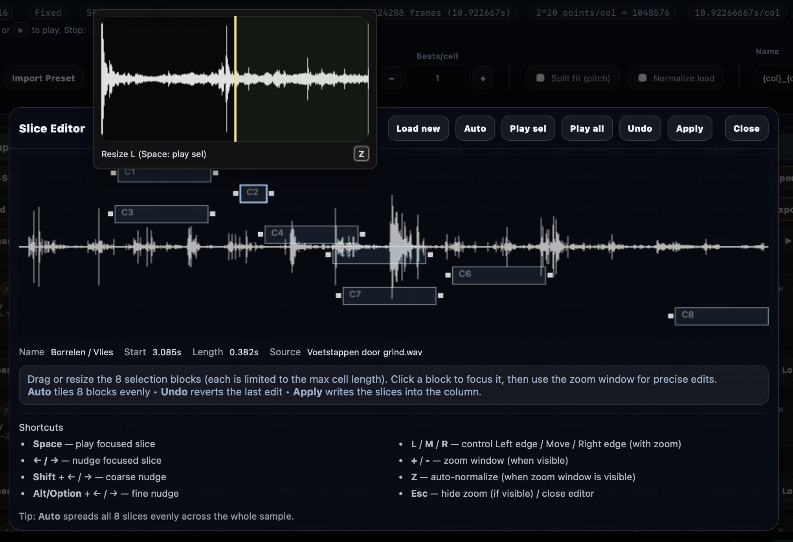
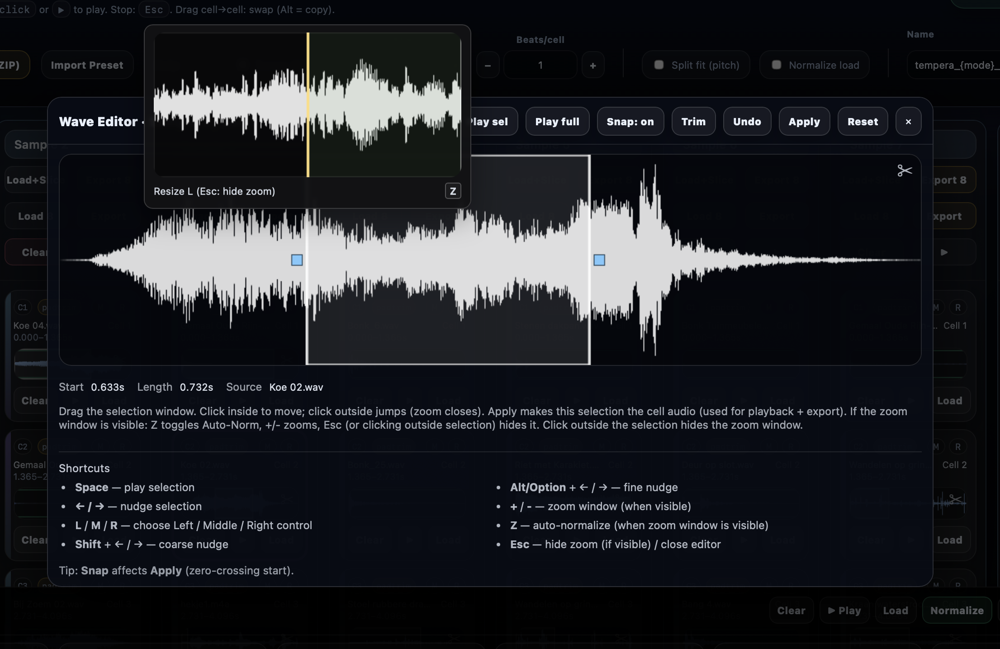
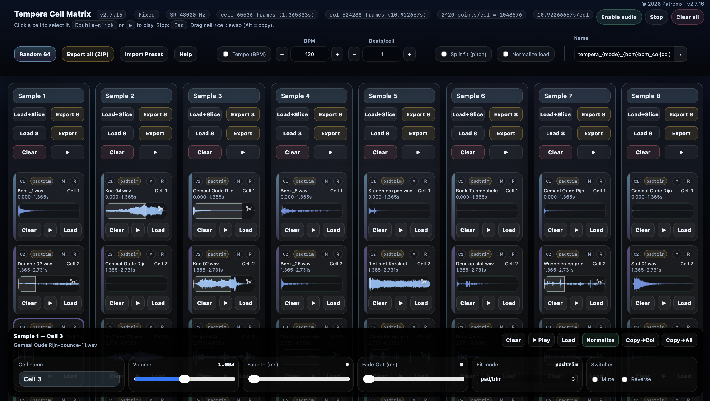

# Tempera Cell Matrix (TCM)

**Tempera Cell Matrix (TCM)** is a standalone, web-based editor for the  
**Beetlecrab Tempera** granular synthesizer.

Focus: **fast, visual sample preparation** that feels like an **instrument**, not a dialog.

👉 **Live app:**  
https://patronix-music.github.io/tempera-cell-matrix/

---
## ✨ What’s new in v2.9

### CPU and memory overload for Safari fixed. Chrome is also low on CPU.
- NEW RELEASE and separate HELP-editor for easy writing.
- Import Preset restores selection for long samples (mini-wave + Wave Editor).
- Sliders are themed with double-click option for reset.
— Reset Volume/Fade sliders on every load (Load, Load 8, Load+Slice, Random 64).
- Green play-outline plays length of sample instead of cell.
- Source file duration in Wave/Slice editor.
- Slice behavior fine-tuned.
- Scissors only visible when file is edited, also when preset is loaded.
- IOS Audio is audible and file picker can load WAV files.

## ✨ What’s new in v2.7

### Load + Slice Editor (major upgrade)
- Visual slicing (no more blind splits)
- Live **zoom window** that follows your selection
- **Z** = auto zoom / auto normalize
- **L / M / R** = left edge / move / right edge
- Sample-accurate nudging

### Wave Editor
- Same zoom & shortcuts as Slice Editor
- Clear selection handles
- Predictable **ESC** workflow (zoom → editor)

### Workflow & Export
- **Export 8**: export all 8 cells as individual WAV files (zipped)
- Cell names stored in presets and used in exports
- Preset import/export preserves slices and trims

---

## 🧠 UX philosophy
- What you see is what you edit  
- No hidden state, no guessing  
- Same gestures everywhere  
- Focus stays on the waveform  

---

## 📸 Screenshots

### Slice Editor

### Wave Editor

### Main 8x8 Matrix

---

## 🚀 Getting started
1. Open the app in a modern browser
2. Click **Load+Slice**
3. Slice visually, apply
4. Name cells if needed
5. Export or save a preset

No install. No build. Just open and go.

---

## ⌨️ Core shortcuts
- **Z** — toggle zoom / auto-normalize  
- **L / M / R** — left / move / right  
- **Arrow keys** — nudge selection  
- **ESC** — close zoom → close editor  

(Full list is available in the in-app Help.)

---

## 🛠 Technology
- Single-file HTML app
- Web Audio API
- No external dependencies
- Runs fully client-side

---

## 📄 License
MIT License  
© 2026 Patronix
