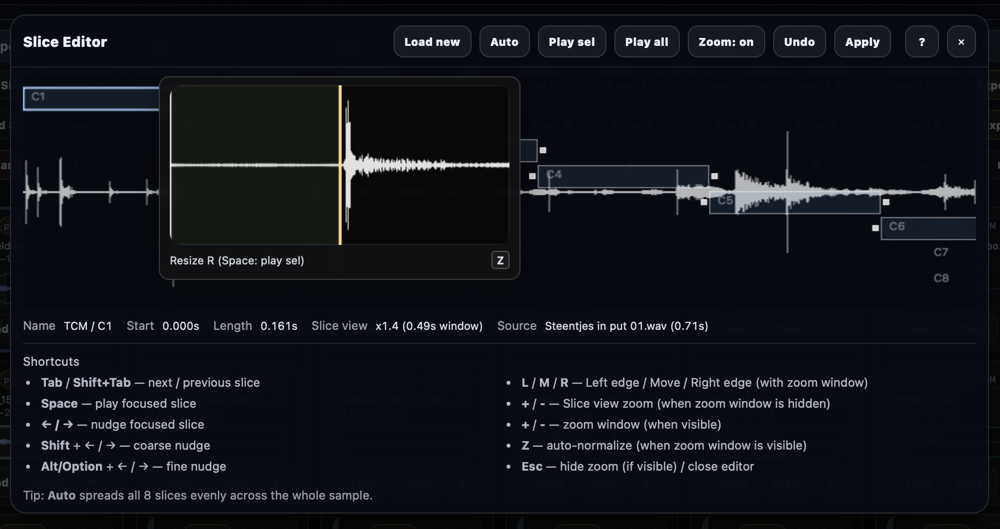
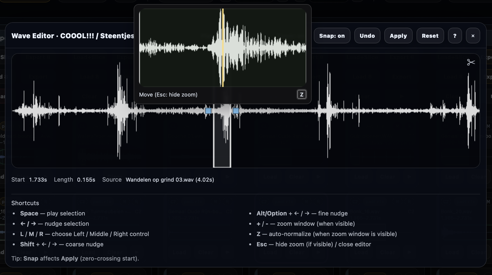
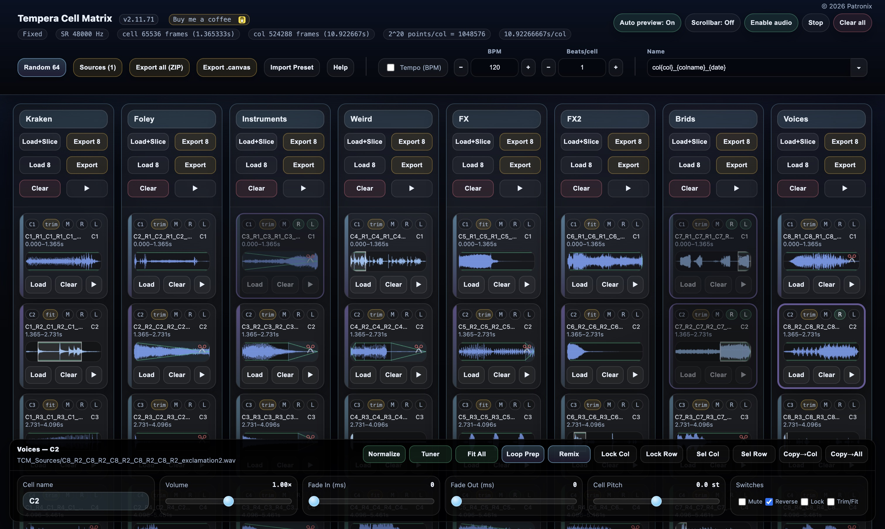

# Tempera Cell Matrix (TCM)

TCM is a fast browser-based sample matrix for building **Beetlecrab Tempera-ready**
`.canvas` files, slicing loops, tuning cells, preparing sampler grids and
exporting clean WAV/ZIP presets without leaving the browser.

👉 **Live app:**  
https://patronix-music.github.io/tempera-cell-matrix/

---

## 🔥 TCM v2.12.81 🔥

### Main new features:

- 🎚️ **Auto fade presets**
  Added Click-safe, Soft, Strong and Custom Auto fade presets.
  `A` applies Auto fade, while `Shift+A` opens the settings.

- 🎵 **Improved Cell Pitch workflow**
  Cell Pitch now supports faster and finer tuning steps:
  normal, Shift and Alt/Option precision control. Keyboard shortcut: `-` / `+`

- 🎛️ **Compact Tuner shortcuts**
  `T` opens now the Tuner. `F` is now for fitting your long samples.

- 🧲 **Wave Editor Snap**
  Wave Snap now defaults to off, remembers its setting, and snaps
  released L/R handles to the nearest nearby zero crossing.

- ✂️ **Slice Editor Snap**
  Slice Snap was added for L/R handle release and also works after
  L/R arrow nudges settle.

- 🎨 **Matrix palettes**
  The app logo now cycles and remembers matrix palettes, including
  stronger fun-style "Logo 4" colors.

### Fixes and improvements:

- 🧩 **Wave and Slice zoom mapping stabilized**
  Zoom and magnifier mapping are now more consistent in both editors.

- ↩️ **Better undo coverage**
  Column Clear can now be undone with `Cmd/Ctrl+Z`.

- ✂️ **Wave Editor selection fixes**
  Wave Editor `Esc` now preserves long-sample selections, and sliced
  cell edits persist correctly.

- 🔊 **Fade rendering fixes**
  Fade-out and fade envelopes now follow the audible trimmed or
  fit-rendered sample length more accurately.

- 🎛️ **Fit mode fix**
  Fit mode no longer mirrors temporary Wave Editor selections, so
  Trim and Fit behave separately again.

- 📘 **Help shortcut**
  Clicking the version text opens Help directly at the Release notes.

- 🧹 **Interface cleanup**
  Colors are reduced (better with matrix palletes),
  buttons (also with shift function) are visible on or off and consistent.  
---

## What TCM can do

TCM gives you an **8 × 8 sample matrix** for preparing, slicing, tuning,
editing and exporting samples for Tempera and other sampler workflows.

### Sample matrix workflow

- Load samples into individual cells or full columns.
- Use **Load 8**, **Random 8** and **Random 64** for fast sample filling.
- Keep important cells safe with **Cell Lock**, **Lock row** and **Lock col**.
- Use reusable **Random Sources** folders for fast random sample selection.
- Duplicate detection helps avoid repeated samples when possible.
- Auto preview lets you hear cells while navigating the matrix.

### Editing and performance tools

- Adjust **Volume**, **Fade in**, **Fade out**, **Reverse**, **Mute** and
  **Trim/Fit** per cell.
- Use **Cell Pitch** to tune individual cells.
- Open the compact **Tuner** to fine-tune stable-pitch samples.
- Apply **Auto fade** with Click-safe, Soft, Strong or Custom presets.
- Normalize one cell or multiple selected cells.
- Use multi-select to edit groups of cells quickly.
- Undo is available for important destructive actions.

### Wave and Slice editing

- Open the **Wave Editor** from any cell waveform.
- Trim exact sample regions with zoom and handle control.
- Use optional **Snap** to place edges on nearby zero crossings.
- Use the **Slice Editor** to divide one sample into 8 playable cells.
- Zoom and magnifier tools help with precise edits.
- Slice and Wave Editor settings are designed for quick keyboard workflow.

### Long sample handling

- Keep long samples trimmed inside one cell.
- Overflow long samples into the cells below.
- Use **Overflow + Fit** to fit a long sample across multiple cells.
- Use **Overflow + Tune** to tune first, then spread the sample.
- Overflow exports stay seamless across cell boundaries.

### Creative column tools

- **Loop prep** loads one loop, fits it to the BPM grid and slices it.
- **Remix** creates quick column variations such as Reverse, Rotate,
  Odd/Even and Random order.
- **Fit all** quickly prepares long loaded samples for timing-based playback.

### Import and export

- Export individual columns or all loaded material as WAV/ZIP.
- Export directly to a real **Tempera `.canvas`** file.
- Optionally use an existing Tempera `.canvas` as a settings template.
- Export and import **template-only presets** without audio.
- Export portable ZIP presets with embedded samples.
- Import presets and relink sample folders when needed.
- Export filenames can use templates, including cell names.

### Sampler grid export

- Export loaded cells as one evenly sliced **Grid WAV**.
- Supports 4, 8, 16, 32 or 64 slice grids.
- Empty cells are skipped automatically.
- Choose **48 kHz** or **44.1 kHz**.
- Designed for Digitakt II Grid Machine and useful for MPC, Force,
  SP-404MKII, Octatrack, Polyend Tracker/Play and 1010music Blackbox.

### Interface

- Runs fully in the browser.
- No installation required.
- Works as a visual sample-prep tool for desktop and tablet workflows.
- Matrix palettes can be changed by clicking the app logo.
- Help, shortcuts and release notes are built into the app.

---

## 📸 Screenshots

### Slice Editor

### Wave Editor

### Main 8x8 Matrix

---

## 📄 License
MIT License  
© 2026 Patronix
