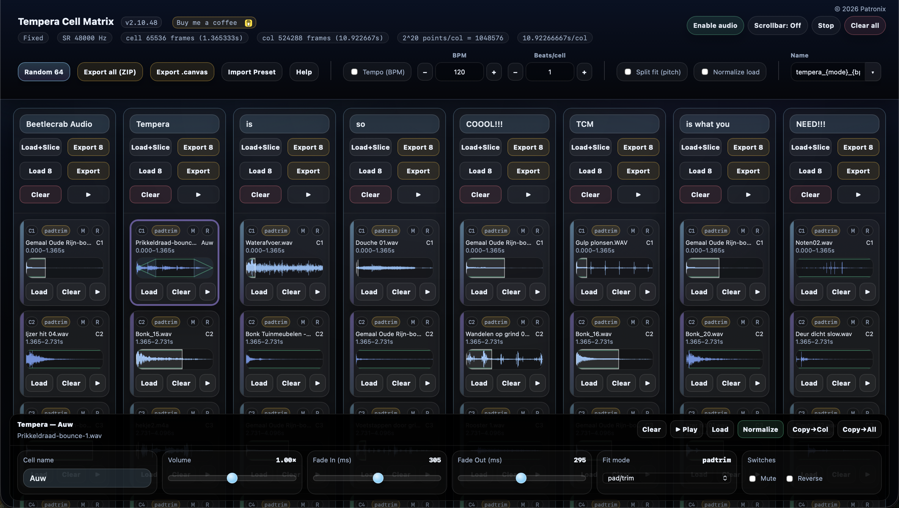

# Tempera Cell Matrix (TCM)

TCM is a fast browser-based sample matrix for building **Beetlecrab Tempera-ready**
`.canvas` files, slicing loops, tuning cells, preparing sampler grids and
exporting clean WAV/ZIP presets without leaving the browser.

👉 **Live app:**  
https://patronix-music.github.io/tempera-cell-matrix/

---

## 🔥 TCM v2.13.65 🔥

This update collects the main changes from **v2.12.82 to v2.13.65**, with a major focus on the new **Matrix Slicer**, better recovery, and experimental wavetable export.

### Main new features:

* 🧩 **Matrix Slicer** — Load one long sample, place custom In/Out points, and spread selected parts across the full 8×8 matrix.

* ✂️ **Point-based slicing** — Use the mouse, playback position, or keyboard shortcuts to create precise segment pairs instead of relying on fixed slicing.

* 🔍 **Segment zoom workflow** — Click segment blocks to zoom in, edit In/Out points, jump between segments, and fine-tune details quickly.

* 🎚️ **Per-segment volume and fades** — Adjust volume directly on the waveform and draw fade-in/fade-out handles per segment.

* 🧼 **Segment Normalize and Auto fade** — Normalize and apply Auto fade inside segment mode, based on what the segment actually sounds like.

* 🎵 **Segment Tuner** — Tune individual Matrix Slicer segments with a compact tuner and non-destructive per-segment pitch.

* 🧭 **Pitch-aware segment placement** — Tuned segments update their effective length, cell span, playhead, preview, Apply and exports.

* 🏷️ **Segment naming** — Name segments for cleaner exports and automatic matrix cell naming after Apply.

* 📦 **Export segments** — Export all Matrix Slicer segments as separate WAV files for reuse outside the matrix layout.

* 🌊 **Export WT from Matrix Slicer** — Create experimental Tonverk-style wavetables from a selected segment.

* 🧬 **Cycle-scan wavetable rendering** — Export WT now scans for usable single-cycle waves, giving fuller and smoother results.

* 🧪 **Matrix Export WT** — Export a 64 × 2048 wavetable directly from loaded matrix cells using the same cycle-scan technique.

* 🛟 **Autosave toggle** — Autosave can be paused from the header, while Enable audio only appears when the browser blocks playback.

* 💾 **Local Quick save** — `Ctrl/Cmd+S` saves a local recovery snapshot, and `S` opens Export all.

* 🕒 **Auto save** — TCM automatically stores a local recovery snapshot about once a minute when something changed, without storing audio.

* 💾 **Better Quick save and Autosave recovery** — Matrix Slicer work is now preserved in recovery, including points, segments, names, fades, volume, pitch, zoom state and source relinking.

* 🔁 **Recovery relink retry** — If the wrong folder is selected during recovery relink, TCM returns to the relink screen instead of losing the recovery.

* ⌨️ **More editor shortcuts** — Matrix Slicer now supports a cleaner shortcut workflow for segment navigation, tuning, normalize, Auto fade and quick saving.

* 🧰 **Improved Sources workflow** — The Sources window can now open Random 64 filters directly.

* 💾 **Local Quick save** — `Ctrl/Cmd+S` saves a local recovery snapshot, and `S` opens Export all.

* 🌊 **Wave Editor shortcut** — Press `E` to open the selected cell directly in the Wave Editor.

---

## What TCM can do

TCM gives you an **8 × 8 sample matrix** for preparing, slicing, tuning,
editing and exporting samples for Tempera and other sampler workflows.

### Sample matrix workflow

- Load samples into individual cells or full columns.
- Use **Load 8**, **Random 8** and **Random 64** for fast sample filling.
- Keep important cells safe with **Cell Lock**, **Lock row** and **Lock col**.
- Use reusable **Random Sources** folders for fast random sample selection.
- Duplicate detection helps avoid repeated samples when possible.
- Auto preview lets you hear cells while navigating the matrix.

### Editing and performance tools

- Adjust **Volume**, **Fade in**, **Fade out**, **Reverse**, **Mute** and
  **Trim/Fit** per cell.
- Use **Cell Pitch** to tune individual cells.
- Open the compact **Tuner** to fine-tune stable-pitch samples.
- Apply **Auto fade** with Click-safe, Soft, Strong or Custom presets.
- Normalize one cell or multiple selected cells.
- Use multi-select to edit groups of cells quickly.
- Undo is available for important destructive actions.

### Wave and Slice editing

- Open the **Wave Editor** from any cell waveform.
- Trim exact sample regions with zoom and handle control.
- Use optional **Snap** to place edges on nearby zero crossings.
- Use the **Slice Editor** to divide one sample into 8 playable cells.
- Zoom and magnifier tools help with precise edits.
- Slice and Wave Editor settings are designed for quick keyboard workflow.

### Long sample handling

- Keep long samples trimmed inside one cell.
- Overflow long samples into the cells below.
- Use **Overflow + Fit** to fit a long sample across multiple cells.
- Use **Overflow + Tune** to tune first, then spread the sample.
- Overflow exports stay seamless across cell boundaries.

### Creative column tools

- **Loop prep** loads one loop, fits it to the BPM grid and slices it.
- **Remix** creates quick column variations such as Reverse, Rotate,
  Odd/Even and Random order.
- **Fit all** quickly prepares long loaded samples for timing-based playback.

### Import and export

- Export individual columns or all loaded material as WAV/ZIP.
- Export directly to a real **Tempera `.canvas`** file.
- Optionally use an existing Tempera `.canvas` as a settings template.
- Export and import **template-only presets** without audio.
- Export portable ZIP presets with embedded samples.
- Import presets and relink sample folders when needed.
- Export filenames can use templates, including cell names.

### Sampler grid export

- Export loaded cells as one evenly sliced **Grid WAV**.
- Supports 4, 8, 16, 32 or 64 slice grids.
- Empty cells are skipped automatically.
- Choose **48 kHz** or **44.1 kHz**.
- Designed for Digitakt II Grid Machine and useful for MPC, Force,
  SP-404MKII, Octatrack, Polyend Tracker/Play and 1010music Blackbox.

### Interface

- Runs fully in the browser.
- No installation required.
- Works as a visual sample-prep tool for desktop and tablet workflows.
- Matrix palettes can be changed by clicking the app logo.
- Help, shortcuts and release notes are built into the app.

---

## 📸 Screenshots

### Slice Editor

### Wave Editor

### Main 8x8 Matrix

---

## 📄 License
MIT License  
© 2026 Patronix
